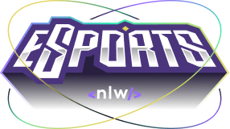
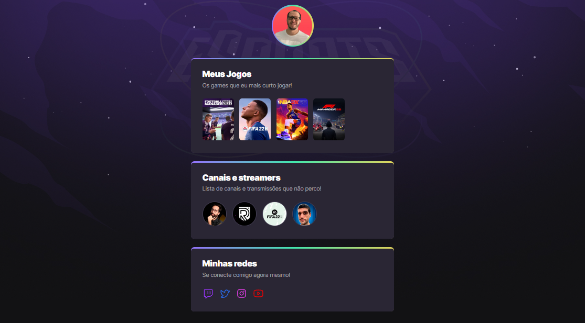

 

# NLW-eSports

> Trilha Explorer

Projeto de um GAMER HUB desenvolvido durante o evento do Next Level Week eSports da Rocketseat.
 
O objetivo do projeto é ser um agregador de links destinado ao conteúdo de eSports conforme o gosto do usuário.

 

## ⚙️ Tecnologias

- HTML
- CSS
- Git e Github

 

## 🌐 Deployment

[Acesse aqui o projeto!](https://andremfdev.github.io/gamer-hub)

 

## 📇 Contatos

Made by andremfdev 👋

 
